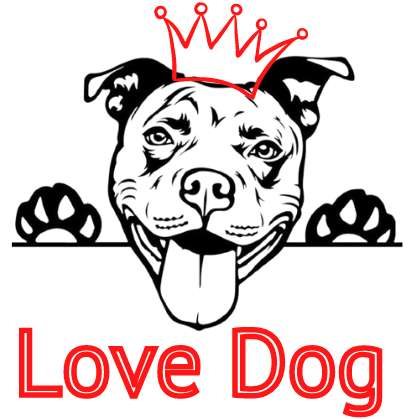

  

<h1>LoveDog</h1>

Tudo sobre os nossos cães

<h1> 💻 Sobre o projeto</h1>

O projeto é um blog destinado a todas as pessoas amantes de cães. Sabemos que hoje em dia, os nossos peludos fazem parte da família e sempre estamos preoucopados com os cuidados necessários que rodeam eles. Por isso essa aplicação foi criada, com intuito de reunir informações importantes para os nossos animais. Com uma interface fácil, leve e intuitiva, vôce pode ler e comentar e os artigos que foram criados por pessoas. E você também pode escrever seu próprio artigo, como uma expêriencia sua com seu cachorro, ou até mesmo alguma dúvida que você queira tirar com os frequentadores do blog. No site, você ainda consegue pesquisar por artigos mais antigos, ou até mesmo comentários utilizando a barra de pesquisa. 

### 🛠 Tecnologias

As seguintes ferramentas foram usadas na construção do projeto:

- [Expo](https://expo.io/)
- [Node.js](https://nodejs.org/en/)
- [React](https://pt-br.reactjs.org/)
- [React Native](https://reactnative.dev/)
- [TypeScript](https://www.typescriptlang.org/)
